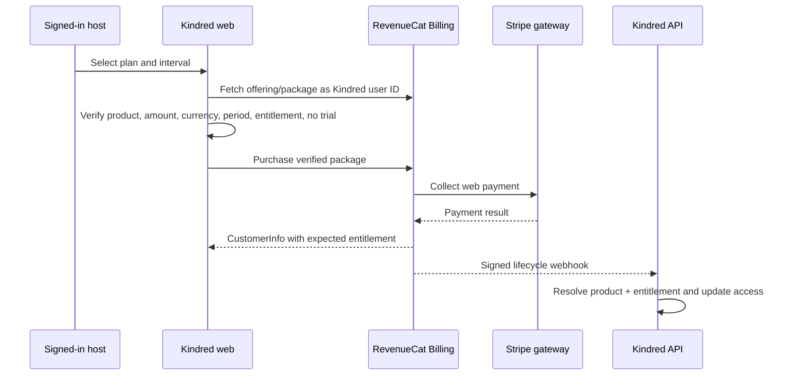

# Commercial readiness review

Date: 2026-07-26
Reviewed base: `0f61fff` (`origin/main`, including the production subscription-checkout kill-switch)
Status: RevenueCat Billing catalog recovered and reconciled on the corrective branch; lifecycle campaign incomplete; purchasing remains disabled; no corrective code deployed, merged, or submitted to a store

## Verified findings

1. Pricing was modeled as one pair of fields per tier, which fabricated a $0 annual value for Seedling and encouraged monthly-first assumptions. The catalog is now a plan × billing-interval matrix: Seedling has only a non-recurring free option; Sapling, Oak, and Redwood each have monthly and annual options; Elder Grove remains custom.
2. The current live public plans API and backend configuration agree on paid amounts: Sapling $9.99/month and $89.99/year; Oak $19.99/month and $179.99/year; Redwood $39.99/month and $359.99/year. The live API still uses the legacy field shape, so the frontend normalizes it during a staged rollout without inventing amounts.
3. Production code and configuration did **not** match the intended architecture. The deployed web bundle called the backend's direct Stripe `/api/subscriptions/checkout` route. RevenueCat Billing products existed in the Kindred RevenueCat project, but the web SDK was absent from the application. RevenueCat Billing uses Stripe only as its payment gateway and is distinct from RevenueCat's Stripe Billing integration.
4. “See all plans” linked to the protected `/subscription` application route, so anonymous visitors were redirected to login. There was no public pricing route.
5. “Explore the strategy deck” linked to `/strategy`, which was not a public route and fell into authentication. The deck also contains venture, naming, competitive, and roadmap content unsuitable for the consumer journey.
6. The policy named Stripe, RevenueCat, Google OAuth, and Gemini, but omitted active Google Analytics/GTM, PostHog, Resend, OpenAI/Whisper/LiteLLM paths, push infrastructure, MongoDB/media storage behavior, and cross-product SSO. It also made unverified claims about provider storage, encryption, and complete deletion.
7. Store documentation still used `kindred.ubuntumarket.com`, while the live site, canonical metadata, sitemap, app links, and email URLs use `www.heykindred.org`.
8. Support surfaces used `support@ubuntu-village.org`, while one subscription message used `hello@kindred.community`. No evidence proves a working branded `@heykindred.org` mailbox.
9. RevenueCat's `elder_grove` entitlement mapped to the non-existent internal ID `elder_grove` instead of `elder-grove`; its stored records also used `tier` without the `plan_id` and `community_id` fields consumed by the canonical subscription path.
10. The RevenueCat webhook read a secret from configuration but did not enforce it. The direct Stripe subscription path and six Price IDs were incorrectly treated as the intended purchase architecture.
11. The public-route prerender script could snapshot the wrong page when another service occupied IPv6 localhost port 3000 and when earlier route output replaced the CSR shell.
12. Native subscription cards used backend USD amounts rather than StoreKit-localized package prices and savings.
13. Paid access and webhook handling did not consistently preserve access through a cancellation/grace period or reject duplicate and out-of-order provider events.
14. Browser-captured prerender output was treated as exact React SSR markup, producing hydration mismatch errors in production.
15. The original RevenueCat Billing web catalog was not safe to activate: Sapling was $29.99/month or $298.99/year with a two-week trial and no entitlement; Oak was $69.99/month or $696.99/year with no entitlement; Redwood monthly was $119.99/month; and the product named `redwood_annual_web` was configured as $999.99 **monthly**.
16. On 2026-07-26 UTC, six replacement RevenueCat Billing products were created because saved prices are immutable. Each replacement has the canonical USD charge, correct monthly/yearly period, no trial or introductory price, the approved three-day billing-issue grace period, and the matching access entitlement. The three active offerings now expose only the replacement web products in `$rc_monthly` and `$rc_annual`; native product assignments were preserved.

## Implementation

- `backend/pricing.py` — canonical plan/interval matrix, exact USD charges, computed savings, cross-platform RevenueCat offering/package/product/entitlement mappings, isolated legacy Stripe Price IDs, reverse resolvers, and import-time fail-closed invariants.
- `backend/dependencies.py` and `backend/subscription_lifecycle.py` — import the canonical catalog, preserve paid access through a verified cancellation/grace period, expire provider-backed access at its authoritative end date, and centralize provider event ordering.
- `backend/setup_stripe_subscriptions.py` — retired; exits without creating or changing Stripe objects.
- `backend/routes/subscriptions.py` — returns HTTP 410 for new direct Stripe subscription checkout; retains read/management compatibility only for existing Stripe subscription records and keeps the separate one-time add-on path.
- `backend/routes/revenuecat.py` — exposes the expected RevenueCat Billing and native mappings, resolves any web/App Store/Play product to one canonical plan/interval/entitlement, and applies RevenueCat lifecycle events idempotently in provider timestamp order.
- `backend/routes/finance.py` — retains Stripe's one-time community contribution path and inbound lifecycle compatibility for already-created Stripe subscription records. It is not a new subscription purchase path.
- `backend/server.py` — replaces the stray `heykindred.com` URL with the canonical public origin.
- `backend/tests/test_subscriptions.py` — corrects obsolete price expectations.
- `backend/tests/test_commercial_readiness_static.py` — covers every paid plan × interval × RevenueCat platform mapping and rejects missing intervals, crossed entitlements, duplicated identifiers, unsupported claims, and accidental reactivation of direct Stripe subscription checkout.
- `frontend/src/hooks/usePublicPlans.js` — loads public plan data from the unauthenticated API with no hard-coded price fallback.
- `frontend/src/components/PublicPlanCards.jsx` — displays both complete paid charges and calculated annual savings; Seedling is explicitly free with no recurring interval.
- `frontend/src/components/PricingPage.jsx` — adds anonymous pricing with all plans, annual options, features, and a clear separation from signed-in management.
- `frontend/src/components/LandingPage.jsx` — removes old price literals and the consumer strategy link; uses live plan data; sends anonymous “fits your circle” and “See all plans” CTAs to public pricing.
- `frontend/src/App.js` — registers `/pricing` outside the protected app and centralizes the invite origin.
- `frontend/src/lib/pricing.js` — normalizes legacy live API fields into the new matrix for a staged rollout while retaining API-sourced amounts.
- `frontend/src/lib/revenuecat.js` — supports both App Store and Google Play, requires the selected product/package interval/entitlement, and displays provider-localized complete charges.
- `frontend/src/lib/revenuecatWeb.js` and `frontend/src/components/SubscriptionPage.jsx` — use RevenueCat's Web SDK with the signed-in Kindred user ID; verify all six live RevenueCat Billing products against the expected offering, package, entitlement, amount, currency, period, product type, and absence of trial/intro pricing before enabling purchase; use RevenueCat customer management; and never call the retired direct Stripe subscription route.
- `frontend/src/index.js` — replaces browser-captured prerender snapshots with a fresh client tree instead of incorrectly hydrating them as exact SSR markup.
- `frontend/src/config/publicIdentity.js` — centralizes canonical origin/company/current support email.
- `frontend/src/components/PrivacyPolicyPage.jsx` — replaces the incomplete policy with code-backed categories, purposes, vendors, AI paths, retention limits, deletion behavior, and controls.
- `frontend/src/components/SupportPage.jsx`, `TermsOfServicePage.jsx`, and `ShareInviteDialog.jsx` — centralize identity and remove misleading privacy/support statements.
- `frontend/src/lib/api.js` — replaces the obsolete-domain fallback with the production API host.
- `frontend/STORE_LISTINGS.md` and `SUBMISSION_CHECKLIST.md` — standardize public URLs and remove “no data harvesting.”
- `frontend/public/sitemap.xml` — publishes the public pricing URL.
- `frontend/scripts/prerender.js` — includes pricing; isolates IPv4 localhost; preserves the CSR shell for every route; blocks service-worker interference; snapshots live plan data; fails on route HTTP errors.
- `frontend/scripts/verify-commercial-readiness.js` — repeatable desktop/mobile anonymous route smoke test and screenshot capture using the live plans response.
- `docs/PRIVACY_DATA_MAP.md` — complete engineering data/vendor map with retention, deletion, controls, and confirmations.
- `docs/APP_STORE_PRIVACY_DECLARATIONS.md` — owner worksheet for Apple App Privacy and Google Play Data Safety.
- `docs/COMMERCIAL_READINESS_DECISIONS.md` — implemented decisions and owner confirmations.
- `docs/screenshots/*.png` — desktop/mobile pricing and navigation evidence.

## Architecture verdict and provider mapping audit

The intended active architecture is RevenueCat Billing on web and RevenueCat's native SDK on App Store/Google Play. RevenueCat owns the selectable products, packages, customer identity, entitlements, renewal/cancellation state, and lifecycle events. Stripe is RevenueCat Billing's web payment gateway, not Kindred's subscription catalog. Direct Stripe remains appropriate only for community contributions, one-time add-ons, and lifecycle compatibility for existing direct-Stripe subscription records.

| Plan | Interval | Canonical charge | Superseded web product / prior result | Replacement web product | Package / entitlement | Validator |
|---|---|---:|---|---|---|---|
| Sapling | Monthly | $9.99/month | `sapling_monthly_web`: $29.99/month, two-week trial, no entitlement | `sapling_monthly_web_v2` | `$rc_monthly` / `sapling_access` | **Pass** |
| Sapling | Annual | $89.99/year | `sapling_annual_web`: $298.99/year, two-week trial, no entitlement | `sapling_annual_web_v2` | `$rc_annual` / `sapling_access` | **Pass** |
| Oak | Monthly | $19.99/month | `oak_monthly_web`: $69.99/month, no entitlement | `oak_monthly_web_v2` | `$rc_monthly` / `oak_access` | **Pass** |
| Oak | Annual | $179.99/year | `oak_annual_web`: $696.99/year, no entitlement | `oak_annual_web_v2` | `$rc_annual` / `oak_access` | **Pass** |
| Redwood | Monthly | $39.99/month | `redwood_monthly_web`: $119.99/month | `redwood_monthly_web_v2` | `$rc_monthly` / `redwood_access` | **Pass** |
| Redwood | Annual | $359.99/year | `redwood_annual_web`: $999.99/month, wrong interval | `redwood_annual_web_v2` | `$rc_annual` / `redwood_access` | **Pass** |

Verification timestamp: 2026-07-26 01:00 UTC. All six replacement rows were re-read from the RevenueCat dashboard after creation. Each is an active subscription in the Kindred RevenueCat Billing app, priced in USD, has the expected `P1M` or `P1Y` period, has no free trial or introductory phase, has a three-day billing-issue grace period, and is attached to exactly the expected entitlement. The three active offerings were then re-read and each returned one replacement monthly web product and one replacement annual web product. No superseded web product remains exposed. The associated Stripe account is used as RevenueCat Billing's payment gateway; no Stripe catalog Price object is selected by this flow.

Native products are mapped to the same entitlements:

- App Store: `com.kindred.<plan>.monthly|annual`.
- Google Play: `kindred_<plan>:<plan>-monthly|yearly`.
- Offerings: `sapling_access`, `oak_access`, and `redwood_access`, each with `$rc_monthly` and `$rc_annual`.

The six historical Stripe subscription Price IDs are retained only for inbound legacy record resolution. They are not selectable by current application code and remote Stripe Price verification is no longer a release gate for the RevenueCat Billing path.

RevenueCat webhook resolution uses the documented top-level `product_id`, `entitlement_ids`, and `expiration_at_ms` fields. A `PRODUCT_CHANGE` alone does not activate a new tier because it may represent a deferred change; activation waits for the accompanying effective purchase or renewal event. Cancellation retains access until the expiration event.

RevenueCat `TRANSFER` and `TEMPORARY_ENTITLEMENT_GRANT` events remain deliberately non-activating. Before external release, exercise transfer, refund/revocation, grace-period recovery, and temporary-entitlement behavior in an authorized sandbox and decide whether `TRANSFER` should trigger an immediate provider reconciliation. Provider-backed records now fail closed after their authoritative end date even if a terminal event is missed.

## Verification results

- Deployed production bundle: directly calls `/api/subscriptions/checkout`; this proves the architecture merged in PR #11 is not the intended RevenueCat Billing flow.
- Production API: `GET /api/subscriptions/plans` returns all six canonical amounts; unauthenticated `POST /api/subscriptions/checkout` returns 401, proving the direct route is reachable without initiating a checkout.
- RevenueCat project catalog: **pass**. All six replacement products and all three offering/package mappings match the canonical matrix. The old products were retained for history but removed from active offering exposure. App Store mappings were preserved and Google Play configuration was not modified.
- RevenueCat Billing sandbox, successful monthly purchase: **pass**. The hosted sandbox displayed $9.99/month, payment completed with a Stripe test-mode method, and RevenueCat showed an active `sapling_access` entitlement for `sapling_monthly_web_v2`.
- RevenueCat Billing sandbox, successful annual purchase: **pass**. The hosted sandbox displayed $89.99/year, payment completed with a Stripe test-mode method, and RevenueCat showed an active `sapling_access` entitlement for `sapling_annual_web_v2`.
- RevenueCat Billing sandbox, checkout cancelled before payment: **pass**. Navigation returned to package selection without submitting payment.
- Remaining sandbox lifecycle campaign: **incomplete**. Failed initial payment, renewal evidence, cancel-through-expiration, billing failure/grace/recovery, refund/revocation, customer portal, authenticated Kindred identity, mobile entitlement visibility, and webhook replay/order scenarios remain open. Annual renewal requires RevenueCat's accelerated approximately 60-minute sandbox cycle; monthly renewal is approximately five minutes. No upgrade/downgrade scenario exists because subscription-change paths are intentionally empty.
- Google Play RTDN: connected and verified using RevenueCat's **Last received** timestamp after a Play Console test on 2026-07-25. No configuration was changed during this reconciliation.
- Apple RevenueCat Production and Sandbox connection: owner reports verified on 2026-07-25. No configuration was changed during this reconciliation.
- Python compilation for all affected backend modules: **pass**.
- `pytest backend/tests/test_commercial_readiness_static.py -q`: **16 passed**.
- Frontend pricing and RevenueCat Billing unit tests: **8 passed**.
- Production frontend build and public-route prerender: **pass**.
- Anonymous desktop/mobile browser smoke, keyboard navigation, and console/page-error check: **pass**.
- `git diff --check`: **pass**.
- The legacy provider-dependent integration tests were not executed: they require an external API and historically created accounts or checkout sessions. Their stale direct-checkout expectations were corrected without initiating any provider flow.

## Unresolved owner / legal decisions

1. Confirm or create a branded support mailbox. The current verified identity remains `support@ubuntu-village.org`; a nonexistent address was not guessed.
2. Confirm Elder Grove capacity, eligibility, nonprofit language, and sales process.
3. Keep the RevenueCat production public web SDK key and public purchase controls disabled until the lifecycle campaign passes and a separate restoration is approved. The catalog-equality gate is complete.
4. Complete the authorized RevenueCat Billing sandbox lifecycle campaign: failed initial payment, monthly and annual renewal, cancellation through expiration, billing failure and grace recovery, refund/revocation, customer portal, authenticated Kindred identity, mobile visibility, duplicate/out-of-order webhook delivery, transfer, and temporary entitlement. Upgrade/downgrade is not applicable until an explicit subscription-change path is deliberately designed. Direct Stripe subscription lifecycle testing is required only if existing direct-Stripe subscribers are confirmed.
5. Confirm the production AI provider/model and its retention/no-training contract.
6. Confirm hosting/database region, encryption at rest, backups, logs, and deletion timeframes.
7. Inspect live GTM/PostHog settings and obtain counsel on consent, tracking, sale/share, children, retention, and deletion disclosures.
8. Decide whether to expand deletion to subscriptions, care circles, newer collections, analytics/provider records, logs, and backups.

## Store disclosure action

Use `docs/APP_STORE_PRIVACY_DECLARATIONS.md` to update Apple App Privacy and Google Play Data Safety. The major correction is to answer that Kindred **does collect data** and disclose account/contact data, user content (including photos/audio), identifiers/device tokens, purchase history, product interaction analytics, messages/files, and applicable diagnostics. Purposes, sharing/processor cautions, tracking confirmation, deletion behavior, security confirmation, and exact URLs are specified there.

## Credential hygiene

- The downloaded Kindred Google service-account JSON (`kindred-490818`, service account `revenuecat-play-store`, key suffix `76ba91`) was deleted from Downloads and Trash after the owner confirmed RevenueCat received it and Google Play RTDN was verified. No credential value or raw provider response was saved.
- The incorrectly uploaded Legacy Table credential was identified as project `legacy-table`, service account `revenuecat-play-store`, key suffix `65f89e`. RevenueCat currently reports valid credentials and a recent RTDN receipt, but the current Google account lacks permission to inventory service-account keys. The key was therefore **not** revoked or locally deleted. An authorized Legacy Table owner must create a replacement, upload it to RevenueCat, test API access and RTDN, confirm the new key is active, then revoke suffix `65f89e` and remove the two local duplicate files.

## Rollback

RevenueCat catalog state changed during this authorized recovery. No Stripe, Apple, Google Play, GCP, or production application configuration changed.

For provider rollback, do not delete the versioned products or re-expose the incorrect historical products. If an offering problem is discovered before restoration, remove only the affected replacement product from that offering, leave web purchasing disabled, and compare its immutable definition with the sanitized evidence above. Existing subscriber history must not be deleted.

For code review rollback:

1. Revert the local commercial-readiness change set as one reviewed unit; do not alter the separate damaged legacy checkout.
2. If selectively reverting public pricing, revert `PricingPage`, `PublicPlanCards`, `usePublicPlans`, the `/pricing` route, and the landing/prerender/sitemap changes together so no CTA points to a missing route.
3. If selectively reverting canonical pricing, revert the backend pricing matrix, public API payload, frontend normalization/rendering, RevenueCat Billing/native resolution, and all pricing tests together. Do not retain a provider mapping without its corresponding interval or revert Seedling to fabricated monthly/annual values.
4. Do not re-enable `/api/subscriptions/checkout`, the retired Stripe setup script, or historical Stripe Price selection as a rollback shortcut. Existing direct-Stripe records, contributions, and add-ons can continue through their isolated compatibility paths.
5. If selectively reverting identity/privacy, revert the identity config, policy/support/terms/store-doc changes, and privacy worksheets together to avoid contradictory disclosures.
6. Re-run the backend and frontend pricing regression tests, production build, prerender, and browser smoke before approving any rollback.
