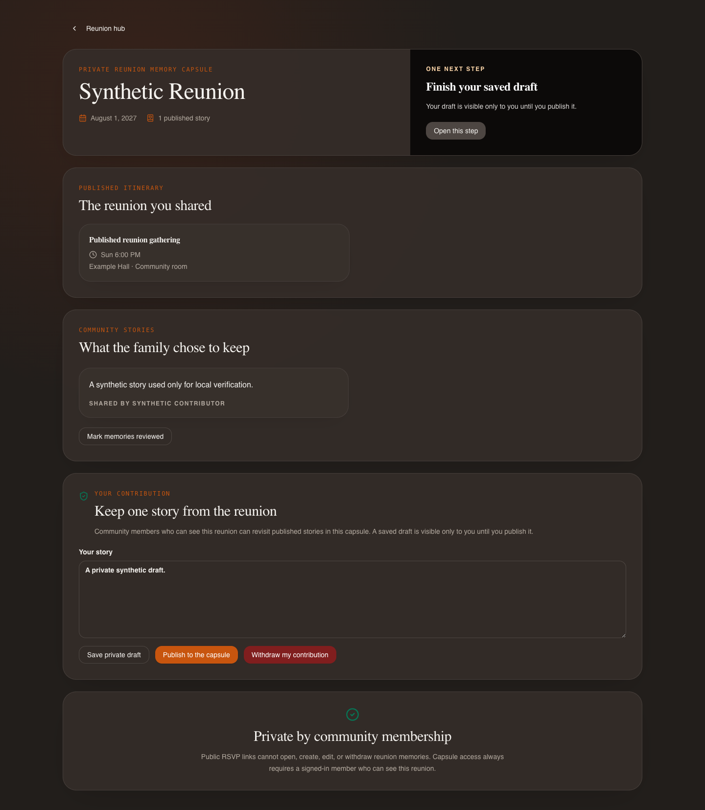
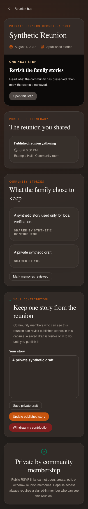

# Release 5: Private Reunion Memory Capsule

Date: 2026-07-30

Status: implementation and synthetic verification complete; draft pull request only

## Provenance and scope

Release 5 started from the exact Release 4 merge commit
`c5bb7bfb289ce1ad53e5679247f0713882110c1c` on `origin/main`.
Its purpose is to turn the attendee hub's optional reunion-story prompt into a
private, durable, text-first reunion memory capsule at
`/reunion/memories/:eventId`.

This release does not deploy, change an App Store or Play listing, read or write
production customer data, invoke an AI model, send a message, or enable the
subscription checkout that remains intentionally killed with HTTP 410.

The implementation preserves:

- invitation credentials in the URL fragment and authenticated API headers,
  never in query strings;
- header-only `/api/public/rsvp`;
- hidden-event confidentiality and cross-community isolation;
- notification recipient isolation;
- RSVP concurrency and idempotency behavior;
- service-worker credential and legacy-route protections;
- privacy-safe invitation redelivery;
- Apple and Google authentication;
- RevenueCat initialization;
- the `subscription_checkout_migrating` HTTP 410 kill switch.

## Product behavior

An authenticated member who is authorized to see a reunion can open its private
capsule, revisit the published itinerary, read published reunion stories, and
manage one contribution of their own. The contribution can be saved as a
private draft, published, edited, or withdrawn. A draft is visible only to its
author. Withdrawal deletes the contribution and stores only a one-way operation
hash on the event so an identical retry converges without retaining story
content.

The screen always presents exactly one backend-selected next action:

| Priority | Action code | Condition |
|---|---|---|
| 1 | `share_first_memory` | No published memories and the member has no draft |
| 2 | `finish_memory_draft` | The member has a draft |
| 3 | `review_reunion_memories` | At least one memory is published and the member has not reviewed the capsule |
| 4 | `reunion_capsule_complete` | The applicable work above is complete |

The existing attendee-hub prompt writes the same deterministic contribution as
the capsule. Retrying that Release 4 action therefore cannot create a duplicate.
Once saved, the attendee hub links directly to the capsule.

## Projection and field matrix

The capsule response is built by a strict allowlist. It does not serialize raw
event, memory, user, RSVP, invitation, notification, or payment records.

| Audience / object | Returned fields | Explicitly excluded |
|---|---|---|
| Authenticated attendee: reunion | `id`, `title`, `start_at`, `end_at`, `timezone` | invitation material, hidden-member lists, organizer notes, RSVP identities, travel, payment, raw event record |
| Authenticated attendee: itinerary | published activity `id`, `title`, times, timezone, venue label/detail, TBA flag | draft activities, audit data, attendee responses |
| Authenticated attendee: shared memory | `id`, story text, contributor display name, timestamps, `is_mine` | draft stories, attachments, tags, AI fields, operation hashes, database IDs |
| Contributor: own contribution | `id`, story text, draft/published status, timestamps | operation/payload hashes, revision internals, database ID |
| Public RSVP visitor | no capsule fields or capability | all capsule reads and mutations |
| Organizer command center | no new capsule content projection | draft or published story content |

## Route and authorization matrix

All capsule routes require a valid account session, matching community
membership, a reunion event, and visibility of that event to the caller.
Failures are returned as not found so hidden and cross-community event existence
is not disclosed.

| Method and route | Purpose | Authorization and mutation rule |
|---|---|---|
| `GET /api/events/{event_id}/memory-capsule` | Read safe capsule projection | Authorized visible-event member only |
| `POST /api/events/{event_id}/memory-capsule/contribution` | Create own draft or published contribution | Event authorization and insert occur in one transaction |
| `PUT /api/events/{event_id}/memory-capsule/contribution/{memory_id}` | Edit/publish own contribution | Deterministic owner identity, idempotency hash, and revision compare-and-swap |
| `DELETE /api/events/{event_id}/memory-capsule/contribution/{memory_id}` | Withdraw own contribution | Owner only; transactionally deletes content and records a hashed retry receipt |
| `POST /api/events/{event_id}/memory-capsule/reviewed` | Mark capsule reviewed | Authorized member; event compare-and-swap |

Invitation and RSVP credentials grant no capsule capability. The public RSVP
screen states that shared memories require both an account and a separate
private invitation.

## Contribution lifecycle and concurrency

| State / operation | Shared visibility | Retry behavior | Ownership |
|---|---|---|---|
| No contribution | none | deterministic create identity | current member |
| Draft | author only | identical idempotency key and payload converge | author can edit, publish, or withdraw |
| Published | authorized visible-event members | identical update converges; stale/divergent operation conflicts | author can edit or withdraw |
| Withdrawn | no story remains | identical withdrawal converges through a one-way receipt hash | no content record remains |

The idempotency key and canonical payload are stored only as SHA-256 hashes.
Plaintext keys are not returned or logged. Concurrent creation uses a stable
MongoDB `_id`; edits use `capsule_revision` compare-and-swap. A definitive 409
refreshes the UI to the latest record and clears the stale operation key, while
ambiguous network failures retain the key for a safe retry.

## Privacy surface audit

Release 5 audited every repository surface that queries memories. A shared
visibility helper now applies community membership, hidden-event filtering, and
draft exclusion consistently.

| Surface | Release 5 behavior |
|---|---|
| General memory list, archive, search, and export | Excludes drafts and memories attached to events hidden from the member |
| Community overview, courtyard, and profile | Excludes drafts and hidden-event memories |
| Health, legacy, and stewardship projections | Excludes drafts and hidden-event memories |
| Weekly digest | Excludes capsule drafts before existing per-recipient hidden-event filtering |
| Batch retag | Cannot select a draft or hidden-event memory |
| Generic memory create | Rejects forged, cross-community, hidden, or nonexistent event associations |
| Generic memory update/delete | Requires the authenticated author; another community member cannot mutate it |
| Notifications and unread counts | No capsule notification is created; existing isolation is unchanged |
| Account/community deletion | Existing memory/event deletion lifecycle remains authoritative |

The capsule path never calls LiteLLM, OpenAI, Gemini, transcription, image,
email, push, analytics autocapture content, or another delivery provider.

## Analytics property matrix

The existing explicit analytics allowlist gained five event names. Only
allowlisted enum-like properties are accepted; story text, event IDs, memory
IDs, invitation values, names, email addresses, and idempotency keys are never
sent.

| Event | Allowed properties used |
|---|---|
| `reunion_capsule_viewed` | `source=memory_capsule` |
| `memory_contribution_started` | `source=memory_capsule` |
| `memory_contribution_saved` | `source=memory_capsule`, `status=draft|published` |
| `memory_contribution_withdrawn` | `source=memory_capsule`, `status=withdrawn` |
| `reunion_capsule_next_action_viewed` | `source=memory_capsule`, `action_code` |

The capsule root has `data-ph-no-capture` as an additional defense against
content autocapture.

## Changed-file inventory

### Backend

- `backend/reunion_memory_capsule.py` — strict projection and next-action policy.
- `backend/memory_privacy.py` — reusable event-aware memory visibility and
  ownership helpers.
- `backend/routes/reunion_memories.py` — authenticated lifecycle routes,
  transactions, idempotency, compare-and-swap, and withdrawal receipt.
- `backend/models.py` and `backend/server.py` — request models and router
  registration.
- `backend/dependencies.py` — author-only resolution for capsule drafts on
  single-memory routes.
- `backend/routes/attendee.py` and `backend/attendee_hub.py` — deterministic
  Release 4 prompt continuity and capsule path.
- `backend/event_privacy.py` — protects capsule review and withdrawal internals
  from general event projections.
- `backend/routes/timeline.py`, `community.py`, `digest.py`, `health.py`,
  `legacy.py`, and `steward.py` — privacy corrections across memory consumers.
- `backend/tests/test_reunion_memory_capsule.py` and
  `backend/tests/test_reunion_security_disposable_db.py` — pure, static, API,
  transactional, concurrency, ownership, and leakage coverage.

### Frontend

- `frontend/src/components/ReunionMemoryCapsulePage.jsx` — responsive capsule
  experience with draft, publish, edit, withdraw, review, conflict, and offline
  states.
- `frontend/src/App.js` — authenticated capsule route.
- `frontend/src/components/ReunionAttendeeHubPage.jsx` — attendee-hub
  continuity.
- `frontend/src/components/PublicRSVPPage.jsx` — capability-boundary copy.
- `frontend/src/components/MemoryVaultPage.jsx` — own-record-only edit/delete
  controls.
- `frontend/src/lib/analytics.js` and `analytics.test.js` — event allowlist and
  privacy tests.
- `frontend/scripts/verify-reunion-memory-capsule.js` — synthetic,
  external-request-blocked browser campaign and screenshots.

### Documentation

- `docs/PRIVACY_DATA_MAP.md` — capsule storage, retention, deletion, and provider
  boundary.
- This report and the two screenshots under `docs/screenshots/release-5/`.

## Verification evidence

All tests used repository-local or disposable synthetic data. No production
customer record or provider was accessed.

| Campaign | Result |
|---|---|
| Capsule and attendee focused backend tests | 21 passed |
| Expanded backend unit/regression campaign | 207 passed |
| Disposable MongoDB replica-set capsule security campaign | 1 passed |
| Disposable MongoDB invitation-redelivery regressions | 3 passed |
| Frontend unit tests | 5 suites, 28 tests passed |
| Production web build and static prerender | passed |
| Capsule desktop/mobile browser campaign | passed; draft, publish, review, withdraw, conflict transport, offline lockout, and zero external requests |
| Existing commercial-readiness browser campaign | passed; service-worker purge/upgrade, fragment and header credential transport, legacy protection, third-party isolation, public/legal/store surfaces |
| OpenAPI inspection | all 5 capsule operations present; 157 total paths; no token, credential, email, or invite-code parameter names on capsule operations |
| Python formatting | Black check passed for the 16 files in formatter scope; the targeted dependency guard retains that legacy file's existing style |
| Python syntax and lint | `compileall` and Flake8 with Black-compatible `E501,W503` ignores passed |
| Diff/log/secret scans | passed |
| Android native sync and debug assembly | passed; 340 Gradle tasks |
| iOS native sync, Pods, and unsigned device build | passed; `BUILD SUCCEEDED` |
| Generated web/Android/iOS marker scan | passed |
| Deployable QA-disable-switch diff scan | passed |

The disposable MongoDB container and native build trees were removed after
verification.

## Reproducible screenshots

The screenshots are generated from the real production frontend build with
synthetic capsule data and all external requests blocked.

## Known limits and intentionally unverified work

- Production database transaction support, active hosting configuration, and
  production provider settings were not inspected. The database campaign used a
  disposable local MongoDB replica set.
- Physical iOS/Android devices, screen readers, store review, and production
  notification delivery were not exercised. Responsive browser checks,
  semantic labels, focusable controls, safe-area layout, offline behavior, and
  unsigned native compilation were exercised.
- There is intentionally one text contribution per member per reunion in this
  release. Attachments, reactions, social sharing, AI summaries, organizer
  moderation, and public galleries are out of scope.
- Existing older non-owner authored community-content deletion gaps remain as
  documented in `docs/PRIVACY_DATA_MAP.md`.
- No deployment, merge, production mutation, provider call, outbound message,
  or store publication is part of this release.
