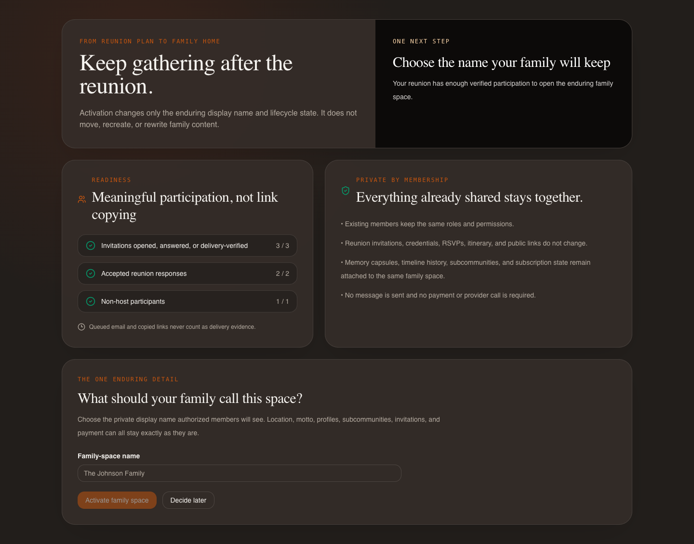
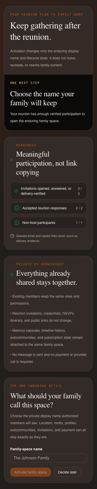

# Release 6: Family Space Activation

Date: 2026-07-31

Status: implementation and synthetic verification complete; draft pull request only

## Provenance and scope

Release 6 started from the exact Release 5 merge commit
`ee233aa3c1fd9ed830f9c054dd4a1113b1c40add` on `origin/main`. It adds a
focused `/family/activate` continuation for reunion-first organizers. The flow
explains readiness using aggregate evidence, asks only for the enduring private
family-space name, confirms the membership/privacy boundary, and returns to the
existing authenticated home. Deferring changes nothing.

This release does not deploy, merge, read or mutate production customer data,
send a message, call a delivery or payment provider, change a store listing, or
enable checkout. The subscription checkout remains HTTP 410 with
`subscription_checkout_migrating`.

It preserves invitation credential transport, header-only public RSVP,
legacy-link protection, hidden-event confidentiality, notification isolation,
RSVP and contribution concurrency, service-worker protections, privacy-safe
redelivery, Apple and Google authentication, RevenueCat initialization, and
the organizer, attendee, itinerary, and memory experiences from Releases 3–5.

## Lifecycle-state matrix

Lifecycle is determined only from the durable `lifecycle_state` field. Display
names are never used as a migration signal.

| Record or creation flow | Interpreted state | Activation behavior |
|---|---|---|
| New reunion-first Google/Apple onboarding or bootstrap | `provisional`, revision 0 | Eligible only after backend readiness and organizer authorization |
| New standard registration/onboarding/community creation | `active`, revision 0 | Existing community behavior; activation is neither needed nor offered |
| Existing record explicitly marked `provisional` | `provisional` | Eligible under the same readiness and authorization rules |
| Existing record explicitly marked `active` | `active` | Returns existing active state; divergent activation is rejected |
| Missing, unknown, or ambiguous legacy state | `legacy_unchanged` | Remains unchanged; never inferred from its name and never activated by this route |

Activation is monotonic. There is no reversal route. A successful operation
changes only the enduring display name and lifecycle activation fields while
incrementing the lifecycle revision.

## Readiness-evidence matrix

The backend deterministically selects the strongest qualifying reunion and
returns aggregate counts, stable unmet codes, an elapsed-day bucket, and
exactly one next action. It never returns an event title, person, email,
credential, response record, message, or provider datum.

| Condition | Threshold | Canonical evidence that counts | Evidence that does not count |
|---|---:|---|---|
| Persisted reunion | 1 | Community-scoped event with reunion template | Client draft or copied preview |
| Verified invitations | 3 | Persisted RSVP response, invitation open timestamp, or independently verified delivery timestamp | Copied link, queued email, email-ready state, provider intent |
| Accepted responses | 2 | Canonical `going` or `some` RSVP response | Pending invite or client-only selection |
| Non-host participation | 1 | Non-host RSVP, canonical potluck/volunteer assignment, or published reunion memory | Host-only activity, draft memory, copied link |

Priority is stable: activate when every threshold is met; otherwise the single
next action identifies the first unmet condition. Active and legacy records
receive `open_family_home` and `continue_current_family_space`, respectively.

## Role and authorization matrix

Both `GET` and `POST /api/family-space/activation` require the canonical current
community from the authenticated session. The client cannot supply a community
ID. Events, members, memories, and the compare-and-swap mutation are scoped to
that exact community.

| Caller | Read readiness | Activate | Result |
|---|---:|---:|---|
| Host in current community | yes | yes | Subject to provisional state, readiness, name, revision, and idempotency checks |
| Organizer in current community | yes | yes | Same checks as host |
| Ordinary member | no | no | 403; no organizer control rendered |
| Anonymous visitor / public RSVP guest | no | no | 401; RSVP credential grants no activation capability |
| Host or organizer from another community | own community only | own community only | Cannot observe or mutate the target community |
| Member with platform-admin flag | no | no | Platform flag does not bypass minimum community role |

## Naming and public presentation

The name is NFKC-normalized, whitespace-collapsed, and limited to 2–80 visible
characters. Control, format, surrogate, private-use, and unassigned Unicode
characters; markup/script-like input; blank values; and punctuation-only names
are rejected with categorical errors that never repeat the submitted value.
Global uniqueness is not required and no existence oracle is introduced.

Provisional internal names are blanked on public RSVP, unauthenticated invite
landing, and organizer guest-preview projections. After activation, authorized
members see the enduring name through the existing community/session surfaces;
the community ID and every existing feature route remain unchanged.

## Mutation-preservation matrix

| Data | Activation behavior |
|---|---|
| Community ID and owner | Preserved exactly |
| Member IDs, roles, memberships, and permissions | Preserved exactly |
| Reunion/event associations and hidden-event rules | Preserved exactly |
| Invitations, credentials, RSVP records, and public links | Preserved exactly |
| Itinerary, attendee state, memories, timeline, and subcommunities | Preserved exactly |
| Subscription and provider metadata | Preserved exactly; no payment/provider call |
| Unrelated community audit/profile fields | Preserved exactly |
| Activation fields | Name and lifecycle state set, actor/time and one-way hashes recorded, revision incremented once |

The disposable database campaign snapshots the full synthetic event (including
credential and RSVP state), all scoped users, memory, subscription, and
unrelated community fields before activation and compares them after the race.
The same public RSVP credential works before and after activation; only the
public display name changes from blank to the chosen active name.

## Concurrency and idempotency matrix

| Situation | Durable result |
|---|---|
| First valid activation | One atomic compare-and-swap from provisional expected revision to active revision + 1 |
| Identical retry after success or ambiguous response loss | Same durable outcome returned; no repeated side effect |
| Two concurrent identical requests | One write; both converge on the same result |
| Concurrent or later divergent request | 409; active record remains immutable |
| Stale expected revision | 409; no partial mutation |
| Invalid name, key, role, state, or readiness | Categorical 4xx before mutation |

Only SHA-256 hashes of the idempotency key and canonical normalized payload are
stored. The name and key are never returned in readiness, activation results,
analytics, URLs, or operational reports. The operation has no outbound side
effect to repeat.

## Consumer flow and continuity

The organizer command center shows a provisional-only readiness card. The
focused activation page covers loading, ready/not-ready, validation, offline,
unauthorized, conflict, already-active, legacy, success, and defer states. It
uses a stable browser-session operation key across ambiguous retries and clears
it after a definitive conflict. Success refreshes the canonical session and
navigates to `/home`; defer returns there without a backend mutation.

The old multi-step onboarding funnel is not invoked. Location, motto,
description, taxonomy, profile completion, subcommunity setup, invitations,
and payment are not requested. Organizer command center, attendee hub, memory
capsule, public RSVP, timeline, events, and native clients continue to use the
same community and reunion records.

## Analytics property matrix

The activation surface has `data-ph-no-capture`; analytics sanitization drops
autocapture and replay snapshots on sensitive reunion and activation routes.
Deliberate activation events accept only low-cardinality enum values and
bounded aggregate integers (0–1000).

| Event | Allowed properties |
|---|---|
| `family_space_activation_viewed` | source category, readiness category, elapsed bucket, aggregate counts |
| `family_space_activation_deferred` | source category, readiness category |
| `family_space_activated` | source category, readiness category, `result=success` |
| `family_space_activation_conflict` | source category, readiness category, bounded result category |

Free-form strings, family/community/event/member IDs, emails, credentials,
names, URLs, and customer content are rejected. Unit tests exercise both the
allowlist and the sensitive-route suppression.

## Changed-file inventory

### Backend

- `backend/family_space_activation.py` — explicit lifecycle interpretation,
  safe name normalization, and aggregate readiness policy.
- `backend/routes/family_space.py` — organizer-only readiness and atomic,
  idempotent activation operations.
- `backend/models.py`, `backend/dependencies.py`, and `backend/server.py` —
  creation modes, safe session lifecycle projection, request model, and router.
- `backend/routes/auth.py` — reunion-first provisional creation and standard
  active creation without changing social-login behavior.
- `backend/routes/public.py`, `backend/routes/organizer.py`, and
  `backend/server.py` — provisional-name suppression on unauthenticated/public
  projections.
- `backend/tests/test_family_space_activation.py`,
  `test_family_space_activation_disposable_db.py`, and
  `test_consumer_activation_unit.py` — policy, authorization, race,
  preservation, migration, and creation-flow coverage.

### Frontend

- `frontend/src/components/FamilySpaceActivationPage.jsx` — focused responsive
  activation/defer experience and all required states.
- `frontend/src/components/OrganizerCommandCenterPage.jsx` — organizer
  readiness card and activation link.
- `frontend/src/components/ReunionStartPage.jsx`, `AuthPage.jsx`, and `App.js`
  — explicit reunion-first creation intent and route integration.
- `frontend/src/lib/analytics.js` and `analytics.test.js` — low-cardinality
  event/property allowlist and sensitive-route suppression tests.
- `frontend/scripts/verify-family-space-activation.js` — external-blocked real
  production-build desktop/mobile campaign.
- `frontend/scripts/verify-organizer-command-center.js` — updated synthetic
  readiness fixture for Release 3 regression coverage.

### Documentation and artifacts

- `docs/PRIVACY_DATA_MAP.md` — lifecycle storage, retention, deletion, and
  provider boundary.
- This report and the two synthetic screenshots under
  `docs/screenshots/release-6/`.

## Verification evidence

All records and browser responses were synthetic and disposable. No production
record, deployed endpoint, customer provider, or outbound channel was used.

| Campaign | Result |
|---|---|
| Focused Release 6 and Releases 3–5 continuity backend tests | 83 passed |
| Expanded Release 2–6 backend unit/static regression campaign | 230 passed |
| Disposable MongoDB activation/preservation campaign | 1 passed |
| Disposable MongoDB reunion-security campaign | 1 passed |
| Disposable MongoDB invitation-redelivery campaign | 3 passed |
| Frontend unit tests | 5 suites, 30 tests passed |
| Production web build and prerender | passed for `/`, `/reunion/start`, `/pricing`, `/privacy`, `/terms`, and `/support` |
| Release 6 real-build browser campaign | passed desktop/mobile; readiness, defer/offline, conflict refresh, idempotency transport, denial, active continuity, home navigation, zero external requests |
| Release 3–5 real-build browser regressions | passed desktop/mobile with synthetic local responses and zero external requests |
| Commercial/readiness browser regression | passed; service-worker purge/upgrade, fragment/header transport, legacy protection, third-party isolation, and public/legal surfaces |
| OpenAPI inspection | 158 total paths; GET and POST activation operations; no activation path/query parameters |
| Python formatting | Black 26.1.0 check passed for 9 formatter-scoped changed files; the targeted auth and dependency edits retain those legacy files' existing style |
| Python compilation and lint | `compileall` and focused Flake8 with Black-compatible ignores passed |
| Android native sync and debug assembly | passed; 340 Gradle tasks |
| iOS native sync, Pods, and unsigned device build | passed; `BUILD SUCCEEDED` |
| Diff, log, secret, analytics, provider-disable, and generated-marker scans | passed |

## Reproducible screenshots

The screenshots were generated from the real production frontend build using
synthetic readiness data with all external requests blocked.

## Known limits and remaining gates

- Production lifecycle inventory and database configuration were intentionally
  not inspected or migrated. Ambiguous legacy records fail closed as
  `legacy_unchanged`; an explicit reviewed migration would be separate work.
- Production transaction/topology behavior and provider settings were not
  verified. The race and preservation campaign used a disposable local MongoDB
  replica set with atomic compare-and-swap.
- Physical Android/iOS devices, screen readers, production email/push,
  production analytics consoles, and app-store review were not exercised.
  Responsive browser semantics, keyboard controls, offline behavior, Android
  debug compilation, and unsigned iOS device compilation were exercised.
- No activation reversal, global name uniqueness, guest-to-member conversion,
  payment, bulk invitation, message, or provider call is included.
- Owner review, CI, merge, deployment, any explicit legacy migration, and
  production smoke validation remain release gates. This PR must stay draft,
  unmerged, and undeployed.
